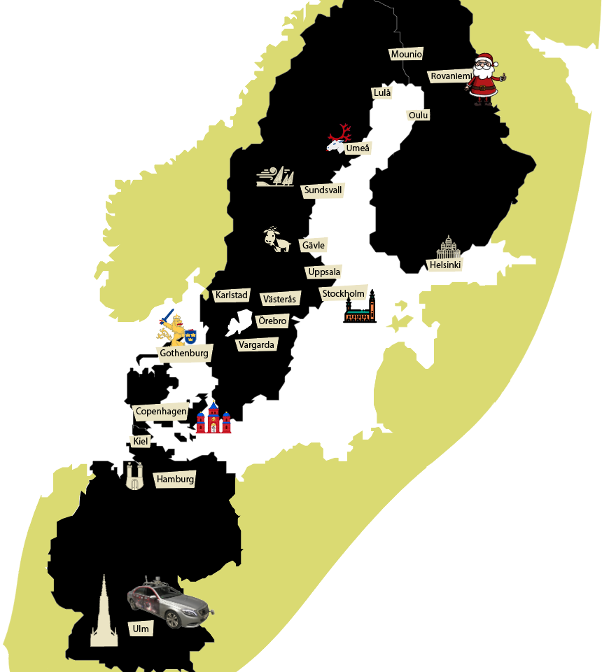
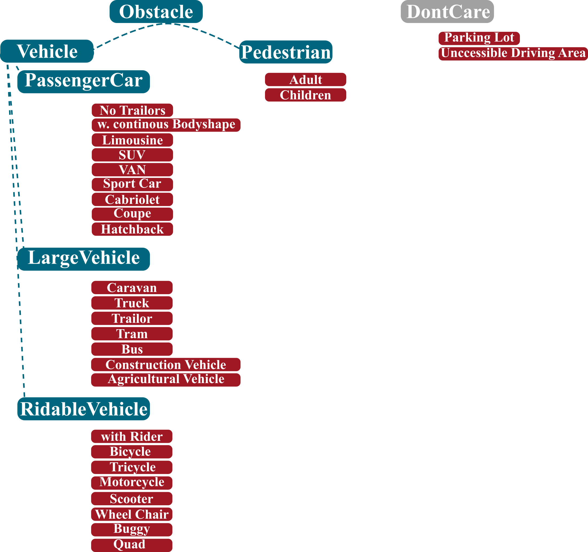

SeeingThroughFog
============================

## [Paper Link](https://www.cs.princeton.edu/~fheide/AdverseWeatherFusion/figures/AdverseWeatherFusion.pdf)

We introduce a object detection benchmark in challenging adverse weather conditions covering 12000 samples in real world driving scenes and 1500 samples in controlled weather conditions within a fog chamber. The dataset covers different weather conditions as Fog, Snow and Rain and was acquired by over 10,000 km of driving in northern Europe. The driven route with cities along the route are shown below. In total 100k Objekts where labeled with accurate 2D and 3D bounding boxes. Main contributions of this dataset are:

- We provide a proving ground for a broad range of algorithms covering signal enhancement, domain adaptation, object detection or multi-modal sensor fusion focusing on the learning of robust redundancies in between sensor especially if they fail asymmetrically in different weather conditions.
- The dataset was created with the initial intention to showcase methods learning robust redundancies in between sensor enabling raw data sensor fusion in case of asymmetric sensor failure induced through adverse weather effects.
  In our case we departed from proposal level fusion and applied a adaptive fusion driven by measurement entropy enabling the detection also in case of unknown adverse weather effects. This method outperforms other reference fusion methods, which even drop in below single image methods.
- Furthermore we compared the method to variety of related methods as domain adaptation, signal enhancement and adverse weather simulation. Please check out our paper for more information. Click [here](https://www.cs.princeton.edu/~fheide/AdverseWeatherFusion/figures/AdverseWeatherFusion.pdf).





### Videos


##### Real world recording in dense fog.


##### Real world recording in heavy snowfall.


##### Real world recording in snow dust.


## Getting Started

Clone the benchmark code.
```
git clone https://github.com/princeton-computational-imaging/SeeingThroughFog
cd SeeingThroughFog
```

For running the evaluation and visualization code you need Python with the following packages:
- tensorflow
- numpy
- cv2
- matplotlib
- qt
- pyqtgraph
- pyquaternion

We provide a conda environment to run our code.
```
conda env create -f environment.yaml
```

Activate the conda environment.
```
conda activate LabelTool
```

Download the SeeingThroughFog dataset from the [DENSE dataset webpage](https://www.uni-ulm.de/en/in/driveu/projects/dense-datasets). Please download the zip files per sensor and copy all sensorfolders into one common dataset folder.

After unzipping the files, your directory should look like this:
```
.
|-- SeeingThroughFogData
    |-- cam_stereo_left
        |-- *.tiff
        |-- ...
    |-- cam_stereo_left_bit_shift
        |-- *.png
        |-- ...
    |-- cam_stereo_left_bit_shift
        |-- *.png
        |-- ...
    |-- lidar_hdl64_last
        |-- *.bin
        |-- ...
    |-- ...
```

### Sensor Setup

To total we have equipped a test vehicle with sensors covering the visible, mm-wave, NIR and FIR band, see Figure below. We measure intensity, depth and weather condition. For more information please refer to our dataset paper.


### Labeling
The final dataset provides about 12000 samples from an extensive data collection campaing with in total 1.4 mio samples. 
The subsampling process is described in depth within the supplemental material. Which can be found [here](https://www.cs.princeton.edu/~fheide/AdverseWeatherFusion/figures/AdverseWeatherFusion_Supplement.pdf).
We provide 2d and 3d annotations for 4 main classes PassengerCars, Pedestrians, RidableVehicles, LargeVehicles. 
If PassengerCars, RidableVehicles and LargeVehicles can not be differentiated the Objects are Labeled within the fallback class 
Vehicle. In case Vehicle and Pedestrians can not be differentiated Objects are labeled as Obstacles. 
Below you can find the illustrated LabelDefinition:



The Annotation format follows the well known [Kitti Format](http://www.cvlibs.net/datasets/kitti/)
with added coloums for 3d Box Rotation angles. You can find the loading functionalities in 

```
./tools/DatasetViewer/lib/read.py
```

Recomended data splits can be found in

```
./splits
```


### Tools
Tools can be found in 
```
"./SeeingThroughFog/tools/".
```
The tools help to viszualize the dataset (DatasetViewer), create a TFRecords dataset (CreateTFRecords), 
create simple fog simulations for lidar and rgb data
(DatasetFoggification) and to quickly reason about the dataset statistics (DatasetStatisticsTool).  


### Reference

If you find our work on object detection in adverse weather useful in your research, please consider citing our [paper](https://arxiv.org/abs/1902.04997):

```
@InProceedings{Bijelic_2020_STF,
    author={Bijelic, Mario and Gruber, Tobias and Mannan, Fahim and Kraus, Florian and Ritter, Werner and Dietmayer, Klaus and Heide, Felix},
    title={Seeing Through Fog Without Seeing Fog:
    Deep Multimodal Sensor Fusion in Unseen Adverse Weather},
    booktitle = {The IEEE Conference on Computer Vision and Pattern Recognition (CVPR)},
    month = {June},
    year = {2020}
}
```

## Acknowledgements
These works have received funding from the European Union under the H2020 ECSEL Programme as part of the DENSE project, contract number 692449.


## Feedback/Questions/Error reporting
Feedback? Questions? Any problems/errors? Do not hesitate to contact us!
